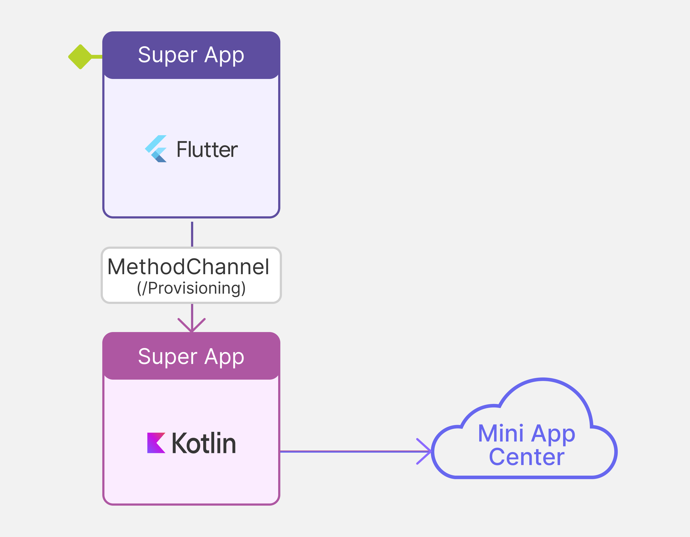
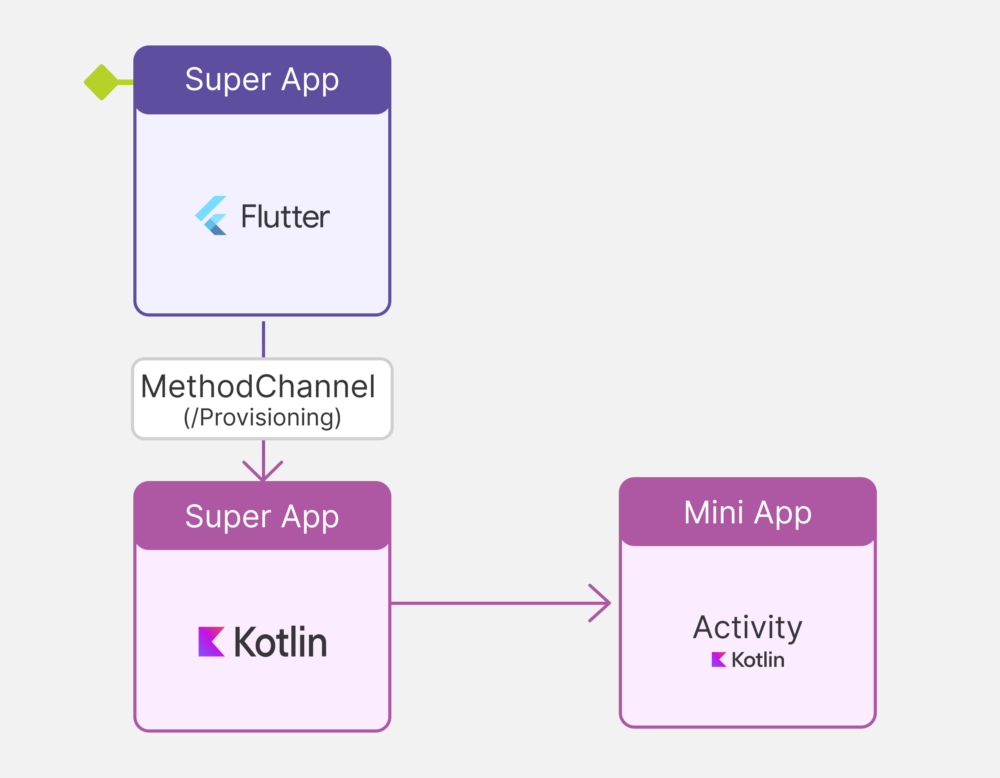

# Flutter Android Super App Example

This document explains how to develop and integrate the functionality that provides the API for accessing the Mini App Center, as well as the API for managing their cache, based on the `MiniAppCaller` example.

## Setting

There are certain initial configuration steps in the project:

1. Integration of the [Android libraries](../../../Android/GeneXus%20Libraries/README.md) corresponding to [Super App Render](../../../docs/SuperAppRender.md).
2. Set the values in the app's [superapp_json](../example/android/app/src/main/res/raw/superapp_json) file:
	- `GXSuperAppProvisioningURL`: String corresponding to the [Mini App Center's](../../../docs/Provisioning.md) URL of the Mini Apps.
	- `GXSuperAppId`: String corresponding to the Super App identifier, to be used at the Mini App Center. If this key is not included, the app's [Package Name](https://developer.android.com/reference/android/content/Context#getPackageName()) will be used.  
	- `GXSuperAppVersion`: String corresponding to the Version of Super App, to be used at the Mini App Center. If this key is not included, the app's [Version Code](https://developer.android.com/reference/android/content/pm/PackageInfo#getLongVersionCode()) will be used.
3. The public key that verifies the signature of the Mini Apps. It's downloaded from the Mini App Center and must be placed in the app's resources under the name [superapp_crt](../example/android/app/src/main/res/raw/superapp_crt).
   
## Communication API with the Mini App Center

To access the Mini Apps that are available on the Mini App Center, the class `SuperAppsHelper` is used. It's included in the `SuperAppsLib` library and accessed via the `Services.SuperApps` static field after [registering the `SuperAppsLib` module](../android/src/main/kotlin/com/genexus/example_superapp/ExampleSuperappPlugin.kt#L44) in the initialization of the class that extends `FlutterPlugin`.

This class provides five methods to load Mini Apps using different criteria. 
The first returns only one Mini App, the rest returns a collection of Mini Apps and, therefore, has these 2 parameters in common:
- `start: Int` 0-based index of the start of the page.
- `count: Int` the number of elements to load (0 corresponds to unlimited).

In all the cases the return value is a `Task<MiniAppCollection, SearchError>`, to which Listeners can be registered to handle the result under the `onSuccess`, `onFailure`, `onCompleted` and `onCanceled` methods.

```kotlin
    /**
     * Performs a request to the Mini App Center for an available Mini App with the given identifier.
     * @param id The Mini App identifier to look for.
     * @return A cancelable Task
     */
    fun searchById(id: String): Task<MiniAppCollection, SearchError>
```

```kotlin
    /**
     * Performs a request to the Mini App Center for available Mini Apps given the text.
     * @param text The string with the search criteria.
     * @param start 0-based index from which elements will be returned.
     * @param count Maximum number of returned elements (0 means no limit).
     * @return A cancelable Task
     */
    fun searchByText(text: String, start: Int, count: Int): Task<MiniAppCollection, SearchError>
```

```kotlin
    /**
     * Performs a request to the Mini App Center for available Mini Apps that are available inside the given circular region.
     * @param center The center point of the specified region.
     * @param radius The radius in meters of the circular region.
     * @param start 0-based index from which elements will be returned.
     * @param count Maximum number of returned elements (0 means no limit).
     * @return A cancelable Task
     */
    fun searchByLocation(center: Location, radius: Int, start: Int, count: Int): Task<MiniAppCollection, SearchError>
```

```kotlin
    /**
     * Performs a request to the Mini App Center for available Mini Apps given the tag.
     * @param tag The tag to search for (exact match).
     * @param start 0-based index from which elements will be returned.
     * @param count Maximum number of returned elements (0 means no limit).
     * @return A cancelable Task
     */
    fun searchByTag(tag: String, start: Int, count: Int): Task<MiniAppCollection, SearchError>
```

```kotlin
    /**
     * Performs a request to the Mini App Center for available featured Mini Apps.
     * @param start 0-based index from which elements will be returned.
     * @param count Maximum number of returned elements (0 means no limit).
     * @return A cancelable Task
     */
    fun searchFeatured(start: Int, count: Int): Task<MiniAppCollection, SearchError>
```

```kotlin
    /**
     * Performs a request to the Mini App Center for available Mini Apps given the filters.
     * @param miniAppFilters Filter collection to apply to the search. It can contain multiple criteria.
     *     Example of usage:
     *     ```
     *     val miniAppFilters = MiniAppFilters().apply {
     *         add(MiniAppFilter("Field Name", MiniAppFilter.Operator.Equal, mutableListOf("Test Mini App Name")))
     *     }
     *     ```
     *     This creates a filter that searches for Mini Apps with "Field Name" equals to "Test Mini App Name".
     * @param start 0-based index from which elements will be returned.
     * @param count Maximum number of returned elements (0 means no limit).
     * @return A cancelable Task
     */
    fun searchByFilters(miniAppFilters: MiniAppFilters, start: Int, count: Int): Task<MiniAppCollection, SearchError>
```
> **_NOTE:_**
>For general information on how GetByFilters works, please refer to:
>
>- [General information](https://wiki.genexus.com/commwiki/wiki?57960,Provisioning.GetByFilters+method)
>- [How to configure attributes in Super Apps](https://wiki.genexus.com/commwiki/wiki?53316,HowTo%3A+Create+a+Super+App+on>+the+Mini+App+Center#Attribute+Configuration+in+Super+Apps)
>- [How to instantiate attribute values at the Mini App Version level](https://wiki.genexus.com/commwiki/wiki?53318,HowTo%3A+Upload+a+Mini+App+version+to+the+Mini+App+Center#Instantiate+attribute+values+at+the+Mini+App+Version+level)

Practical usage examples are available in the source [ProvisioningAPI.kt](../android/src/main/kotlin/com/genexus/example_superapp/ProvisioningAPI.kt).

The example provided is developed in the native Android language (kotlin), therefore [platform channels](https://docs.flutter.dev/platform-integration/platform-channels) must be used to invoke these methods. 

A diagram of this implementation is shown below.



### Error handling

In all cases within the `OnFailureListener` Listener, the error can be one of three types: 

```kotlin
    enum class SearchError {
    	INVALID_REQUEST,
    	NETWORK_ERROR,
    	INVALID_RESPONSE
    }
```
    
- `INVALID_REQUEST` is an error in the caller.
- `NETWORK_ERROR` is a network error in communication with the Mini App Center.
- `INVALID_RESPONSE` is an invalid response from the Mini App Center.

## Loads a Mini App

Once the Mini Apps have been obtained from the Mini App Center, the same `SuperAppsHelper` class is used to load one of them. 
The `load` method receives the Mini App's information from the Mini App Center as a parameter and returns a `Task<Boolean, LoadError>`, which also accepts the Listeners' registry for handling results. 

```kotlin
    /**
     * Loads a Mini App and transitions to it if the passed in Mini App is already installed.
     * @param miniApp The Mini App to load.
     * @return A cancelable Task
     */
    fun load(miniApp: MiniApp): Task<Boolean, LoadError>
```

Practical usage examples are available in the source [ProvisioningAPI.kt](../android/src/main/kotlin/com/genexus/example_superapp/ProvisioningAPI.kt).

The example provided is developed in the native Android language (kotlin), therefore [platform channels](https://docs.flutter.dev/platform-integration/platform-channels) must be used to invoke these methods. 

A diagram of this implementation is shown below.



### Error handling

In all cases within the `OnFailureListener` Listener, the error can be one of three types: 

```kotlin
    enum class LoadError {
    	DOWNLOAD,
    	SIGNATURE,
    	INFORMATION
    }
```
    
- `DOWNLOAD` is an error in downloading the .zip file of the Mini App metadata. 
- `SIGNATURE` is an error in the verification of the .zip file's signature of the Mini App metadata against the file [superapp_crt](../example/android/app/src/main/res/raw/superapp_crt).
- `INFORMATION` is an error in the fields of the Mini App given by the server.

A practical usage example on discovering and loading Mini Apps is available at [ProvisioningAPI.kt](src/main/kotlin/com/genexus/example_superapp/ProvisioningAPI.kt).

To return to the Super App, both the Mini App developer and the Super App developer can use the `exit` method of the `SuperAppsHelper`class. This restores the `Activity` present at the moment in which the Mini App was loaded. 
    
## Mini Apps Cache Management

After loading a Mini App for the first time, it will be kept in the Super App cache. In this way, the next time the Mini App is invoked, the loading will be almost instantaneous.

This will be the case until the cache is no longer valid and it will be discarded, which can occur in these situations:

#### Automatic by version update

When there is a new version of the Mini App published in the Mini App Center, the Mini App's package is downloaded again at the time of the Load.

#### Automatic according to properties declared by the Super App

In the Super App configuration file ([superapp_json](../example/android/app/src/main/res/raw/superapp_json)) these two properties can be set:

   - `GXMiniAppCacheMaxCount`: Value (numeric) to specify the number of Mini Apps that will be kept in the Super App cache. Zero means there is no limit. Otherwise, if the indicated number of Mini Apps in the cache is reached, then the oldest one is deleted before adding a new one.
   - `GXMiniAppCacheMaxDays`: Value (numeric) to specify the number of days each Mini App cache will be kept. Zero means that there is no time limit, otherwise, the time must be counted from the last use of the Mini App, not from the date it was downloaded.

#### Programmatically using the Mini App Cache API

To manually manage the Mini Apps cache, the `SuperAppsHelper` functionality is provided in the same class. 

A method to get a list of the Mini Apps in the cache is included, one to delete a specific Mini App and another one to delete all the existing Mini Apps from the cache. 

```kotlin
    /**
     * Queries the file system for cached Mini Apps.
     * Avoid calling from the main Thread as it performs several file IO operations.
     * @return The cached Mini Apps collection.
     */
    fun getCachedMiniApps(): MiniAppCachedCollection

    /**
     * Removes the Mini App from cache if found for the given identifier and version.
     * Avoid calling from the main Thread as it performs several file IO operations.
     * @param id The Mini App identifier.
     * @param version The Mini App version to remove.
     * @return True if the Mini App was found, False otherwise.
     */
    fun removeMiniApp(id: String, version: Int): Boolean

    /**
     * Removes all Mini Apps from the cache.
     * Avoid calling from the main Thread as it performs several file IO operations.
     * @return True if the cached Mini Apps were correctly deleted from file system, False otherwise.
     */
    fun clearCache(): Boolean
```

In any other case, the Mini App is kept in the cache indefinitely and the OS itself could remove it from the cache at its discretion since it is stored in a temporary directory.
