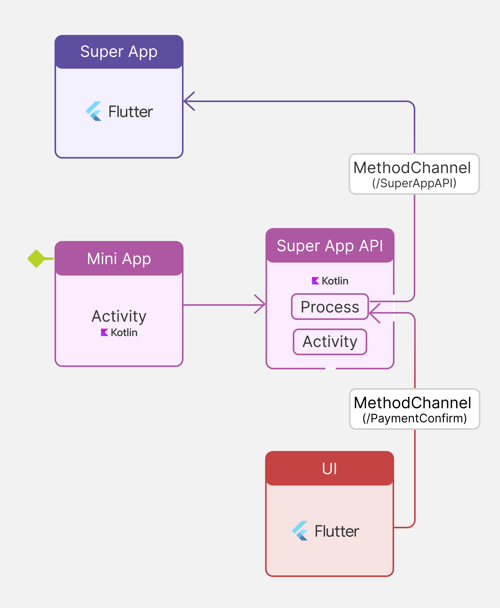
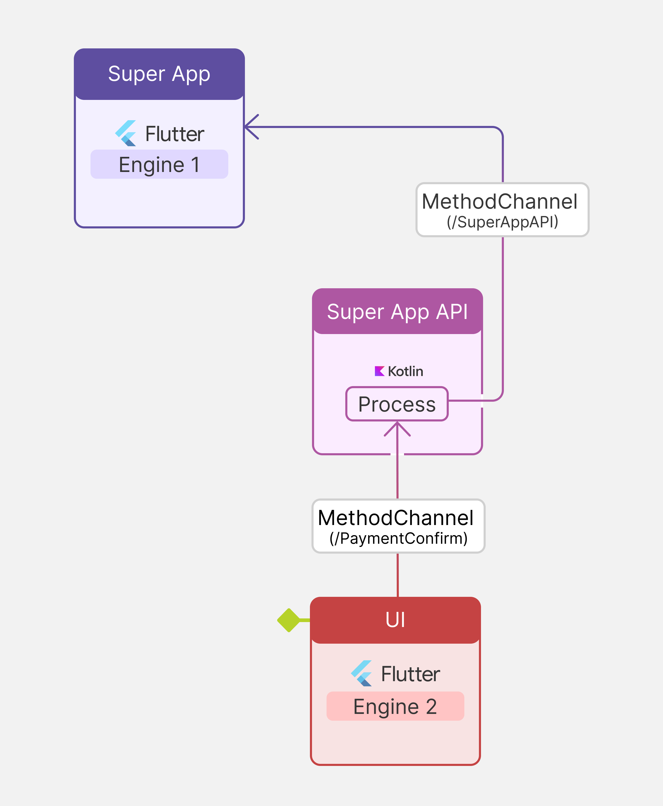

## Introduction

This document briefly details how a functionality provided by a native Super App must be programmed so that it can be referenced from an External Object integrated in a Mini App built with GeneXus.


## Native implementation of the External Object in Flutter

### Module creation
 
The way to integrate a new functionality with the FlexibleClient (GeneXus application manager SDK) is through the GeneXusModule interface and the ExternalApi class.

It's necessary to declare two new classes: one that implements the GenexusModule and another one that extends the ExternalApi. Look at the following example:

```kotlin
class PaymentsApi(action: ApiAction?) : ExternalApi(action) {
    companion object {
        const val NAME = "Payments"
    }
}
```

```kotlin
class PaymentsModule: GenexusModule {
	override fun initialize(appContext: Context?) {
		ExternalApiFactory.addApi(ExternalApiDefinition(PaymentsApi.NAME, PaymentsApi::class.java, false))
	}
}
```

Note:
- The value of the variable NAME (“Payments”) will coincide with the name of the External Object in the GeneXus KB.

### Module registration

This new PaymentsModule must be referenced and registered in the FlexibleClient from the FlutterPlugin class used by the application:

```kotlin
class ExampleSuperappPlugin: FlutterPlugin {

	private var application: ApplicationHelper? = null

	override fun onAttachedToEngine(flutterPluginBinding: FlutterPlugin.FlutterPluginBinding) {
		val context = flutterPluginBinding.applicationContext as Application
		initApplication(context)
		SuperAppAPI.setupChannel(flutterPluginBinding)
	}

	override fun onDetachedFromEngine(flutterPluginBinding: FlutterPlugin.FlutterPluginBinding) {
		SuperAppAPI.destroyChannel(flutterPluginBinding)
	}

	private fun initApplication(context: Application) {
		application = ApplicationHelper(context, entityProvider)
		application?.apply {
			//These modules are provided by GeneXus and required by the Mini Apps in order to work properly.
			registerModule(com.genexus.android.core.externalobjects.CoreExternalObjectsModule())
			registerModule(com.genexus.android.core.usercontrols.CoreUserControlsModule())
			registerModule(com.genexus.android.controls.grids.smart.SmartGridModule())
			registerModule(com.genexus.android.superapps.SuperAppsModule())

			//This is a custom module provided by the native Super App, exposing its public API to the Mini Apps.
			registerModule(PaymentsModule())

			onCreate()
		}
	}

	private val entityProvider = object : IEntityProvider {
		override fun getEntityServiceClass(): Class<out EntityService> {
			return AppEntityService::class.java
		}

		override fun getProvider(): EntityDataProvider {
			return AppEntityDataProvider()
		}
	}
}

```

### Creation and registration of methods

Finally, the implementation of the methods must be provided by declaring new IMethodInvokers. These invokers are referenced and registered by the PaymentsApi itself in its constructor:

```kotlin
class PaymentsApi(action: ApiAction?) : ExternalApi(action) {

	private val methodPayWithoutUI = object : IMethodInvoker {
		override fun invoke(parameters: List<Any>): ExternalApiResult {

		}

		val resultHandler = object : MethodChannel.Result {

		}
	}

    private val methodPayWithUI: IMethodInvoker = object : IMethodInvoker {
		override fun invoke(parameters: List<Any>): ExternalApiResult {
			
		}

		val resultHandler = object : MethodChannel.Result {

		}
	}

    companion object {
        const val NAME = "Payments"
        const val METHOD_PAY_NO_UI = "PayWithoutUI"
		const val METHOD_PAY_UI = "PayWithUI"
    }

    init {
		addMethodHandler(METHOD_PAY_NO_UI, 1, methodPayWithoutUI)
		addMethodHandler(METHOD_PAY_UI, 1, methodPayWithUI)
	}
}
```

Note:
- The name of the methods (“PayWithUI” and “PayWithoutUI”) will coincide with those declared in the External Object in the GeneXus KB.
- The number of method parameters (1) will coincide with the one declared in the External Object in the GeneXus KB.

### Implementation of method functionality

Right now, the "skeleton" of our interface is ready. To achieve the final goal, it only remains to complete the invokers with the desired programming.

The first method is “PayWithoutUI”. As an example, an action that doesn't require user interaction is performed and a value is returned as payment ID through the use of the resultHandler. In a real-life case, this could involve a  call to a service that performs the necessary payment processing.

```kotlin
	private val methodPayWithoutUI = object : IMethodInvoker {
		override fun invoke(parameters: List<Any>): ExternalApiResult {
			val amount = parameters[0].toString().toDouble()
			SuperAppAPI.payWithoutUI(amount, resultHandler)
			return ExternalApiResult.SUCCESS_WAIT
		}

		val resultHandler = object : MethodChannel.Result {
			override fun success(result: Any?) {
				val paymentId = result as String
				getAction()?.let {
					it.setOutputValue(Expression.Value.newString(paymentId))
					ActionExecution.continueCurrent(activity, true, it)
				}
			}

			override fun error(errorCode: String, errorMessage: String?, errorDetails: Any?) {}
			override fun notImplemented() {}
		}
	}
```

Note:
- The only parameter received by the method of the "parameters" variable, corresponding to the amount of the transaction, is obtained. 
- That amount is processed in a "payWithoutUI" method. 
- This same method returns ExternalApiResult.SUCCESS_WAIT, indicating that the execution is waiting for a result to continue (the one returned by the flow).

The second method is “PayWithUI”. It is similar to the previous method. 

In a real-life case, it could be possible to create a payment flow that guides the user by collecting their data to then return the payment ID, completing it.

```kotlin
	private val methodPayWithUI: IMethodInvoker = object : IMethodInvoker {
		override fun invoke(parameters: List<Any>): ExternalApiResult {
			val amount = parameters[0].toString().toDouble()
			UI_RESULT_HANDLER = resultHandler
			SuperAppAPI.payWithUI(amount, activity)
			return ExternalApiResult.SUCCESS_WAIT
		}

		private val resultHandler = object : MethodChannel.Result {
			override fun success(result: Any?) {
				val paymentId = result as String?
				if (paymentId.isNullOrEmpty()) {
					error("2", "Invalid payment id", null)
					return
				}

				getAction()?.let {
					it.setOutputValue(Expression.Value.newString(paymentId))
					ActionExecution.continueCurrent(activity, true, it)
				}
			}

			override fun error(errorCode: String, errorMessage: String?, errorDetails: Any?) {
				ActionExecution.cancelCurrent(getAction())
			}

			override fun notImplemented() {}
		}
	}
```

As this is a typical case of navigation stack mixing, multiple Flutter instances should be used. That each instance is independent and maintains its own internal navigation stack, UI, and application states.
Communication between Flutter instances is handled using [platform channels](https://docs.flutter.dev/platform-integration/platform-channels) through the host platform. 

A diagram of this implementation is shown below.



To access the information provided by the Super App in the other Flutter instance, it is necessary to go through [platform channels](https://docs.flutter.dev/platform-integration/platform-channels) again.

A diagram of this implementation is shown below.



# Definition of the External Object

The definition of the External Object used in this document is the same as [the one described for Android](../../../../Android/MiniAppCaller/README.md).

Some things to take into consideration about this definition:

- The name of the External Object is "Payments". It's important to use the same name in the implementation. 
- The External Object provides two methods: PayWithUI and PayWithoutUI, which receive an integer (amount) and return a _string_ (payment identifier).

## Conclusion

Once the "Skeleton" of the ExternalApi is built, the iteration is reduced to creating new methods with the GeneXus External Object and their respective IMethodInvokers in the native implementation and then "registering" them through ExternalApi.addMethodHandler.


