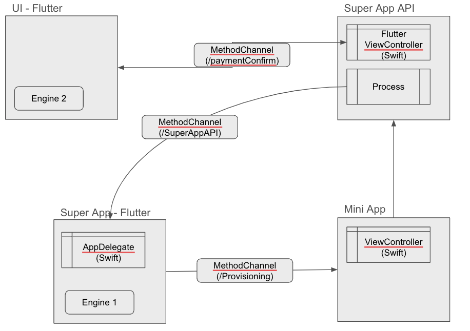

# Introduction

This document briefly details how a functionality provided by a native Super App must be programmed so that it can be referenced from an External Object integrated in a Mini App build with GeneXus.

# Definition of the External Object

The definition of the External Object used in this document is the same as [the one described for Android](../../../../Android/MiniAppCaller/README.md).

Some things to take into consideration about this definition:

- The name of the External Object is "Payments". It's important to use the same name in the implementation. 
- The External Object provides two methods: PayWithUI and PayWithoutUI, which receive an integer (amount) and return a _string_ (payment identifier)

# Implementation for iOS

For the implementation in iOS, you need to follow this steps: 
1. Implement the External Object that complies with the established signature. 
2. Implement an _extension library_ that registers the External Object, and that must be loaded by the Super App. 
3. Modify the _app delegate_ to load the _extension library_.

## External Object implementation

The External Object implementation is found in the [SampleExObjHandler.swift](Runner/SampleExternalObject/SampleExObjHandler.swift) file. It begins by importing `GXCoreBL`, which contains the base class to implement the External Object. 

```Swift
import GXCoreBL
```

Then the class `SampleExObjHandler` is declared, which inherits from `GXActionExternalObjectHandler`:

```
@objc public class SampleExObjHandler: GXActionExternalObjectHandler {
```

It's important to `override` the `handleActionExecutionUsingMethodHandlerSelectorNamePrefix` function returning `true` to use the naming convention, so that the Flexible Client can find the External Object's _method handlers_ correctly:

```Swift
public override static func handleActionExecutionUsingMethodHandlerSelectorNamePrefix() -> Bool {
    return true
}
```

The _method handlers_ implementation must be prefixed with "gxActionExObjMethodHandler_" and then continue with the name of the method as defined in the External Object. In case the method has parameters, they are received in an _array_ of type`Any` that must be processed to obtain the parameters as expected. 

Therefore, the declaration of the methods is as follows: 

```
@objc public func gxActionExObjMethodHandler_PayWithUI(_ parameters: [Any]) {...}
@objc public func gxActionExObjMethodHandler_PayWithoutUI(_ parameters: [Any]) {...}
```
Both methods are similar in terms of the parameter they receive and the result they return. Note that Both methods start by checking the number of parameters.

```Swift
if let error = validateNumber(ofParametersReceived: UInt(parameters.count), expected: 1) {
	onFinishedExecutingWithError(error)
	return
}
```

Also note that if there is an error, the `onFinishedExecutingWithError(_:)` method is called. 

**IMPORTANT**: It is mandatory to call `onFinishedExecutingWithError(_:)` to finish the method's execution, or its equivalent `onFinishedExecutingWithSuccess()` if it was successful. This allows the execution of the commands that follow in the Mini App programming. If these methods are not called, the execution will never end.

After that, both methods try to get the payment amount by calling the `paymentAmout(from:)` auxiliary function. It turns the parameter of type `Any` into an `Int`, which is what the method expects in the definition of the External Object. 

If this value cannot be obtained from the parameter, then the execution ends with an error:

```Swift
let amount: Int
do {
	try amount = paymentAmout(from: parameters[0])
}
catch {
	onFinishedExecutingWithError(error)
	return
}
```

The payment with UI function also tries to get the `presentingController`, in order to display its corresponding UI. This is done in the same `do-catch` as the reading the import. If it can´t get it, then it also fails:

```
try presentingController = presentingViewController()
```

The `presentingViewController()` function is in charge of getting the required View Controller and must be implemented as follows: 

```
private func presentingViewController() throws -> UIViewController {
    guard let presentingController = gxActionHandlerUserInterfaceController?.actionHandlerUserInterfaceController,
            presentingController.presentedViewController == nil else {
        throw NSError.fatalGXError(withDeveloperDescription: "No valid prensenting view controller found for payment UI.")
    }
    return presentingController
}
```
The method without UI is the simplest. Once the amount is obtained, it is just printed in the console and a return value is assigned by calling the  `setReturnValue(_:)` function. In this case and as an example, the returned value is a `GUID` turned into a `String`.

```Swift
print("Received a payment of $\(amount)")
setReturnValue(GXUUID.create().toString())
onFinishedExecutingWithSuccess()
```
As previously stated, the `onFinishedExecutingWithSuccess()` must be called before finishing the execution.


// AQUI CORREGIR //
In the case of the payment with UI, the sample creates a `FlutterViewController`, presents it using the `UINavigationController` and waits for result in gxResultHandler to return the value and finish the execution. 

```Swift
let flutterViewController: FlutterViewController
switch name {
case SampleExObjHandler.Constants.Methods.PAY_UI:
	flutterViewController = FlutterPaymentViewController(data: arguments) { paymentResult in
		gxResultHandler(paymentResult.map { $0 })
	}
default:
	preconditionFailure("unable to obtain flutterActivityController")
}
let navigationController = UINavigationController(rootViewController: flutterViewController)
uiContext.present(navigationController, animated: true, completion: nil)
```

The payment with UI sample shows how the asynchronous case should be handled. Note that even though the execution of the _method handler_ implementation ends after calling the `uiContext.present(navigationController, animated: true, completion: nil)`, the method doesn't finish for the Mini App until the `gxResultHandler()` recive the result and returned to `SampleExObjHandler.swift` and called `onFinishedExecutingWithSuccess()` or `onFinishedExecutingWithError(error)`, if applicable.

As this is a typical case of navigation stack mixing, multiple Flutter instances should be used. That each instance is independent and maintains its own internal navigation stack, UI, and application states.
Communication between Flutter instances is handled using [platform channels](https://docs.flutter.dev/platform-integration/platform-channels) through the host platform. 

A diagram of this implementation is shown below.



## Implementation of the _extension library_

The class that implements the _extension library_ is found in the file [SampleExObjLibrary.swift](Runner/SampleExternalObject/SampleExObjLibrary.swift), which contains the following:

```Swift
import GXCoreBL

class SampleExObjLibrary: NSObject, GXExtensionLibraryProtocol {
	func initializeExtensionLibrary(withContext context: GXExtensionLibraryContext) {
		GXMiniAppsManager.registerSuperAppAPI(SampleExObjHandler.self, forExternalObjectName: "Payments")
	}
}
```

Note that as for the External Obect, an `import GXCoreBL` is done, and also note that the class must implement the `GXExtensionLibraryProtocol` protocol. 

The rest of the code is the implementation of the `initializeExtensionLibrary(withContext:)` function. In this case, it just registers the External Object.

Note that the External Object is registered with the same name with which it was defined, "Payments" in this example.

## Loading the _extension library_

Finally, it's necessary that the _app delegate_ loads the _extension library_ so that it registers the External Object. This is done with the `endCoreInitialization(extensionLibraries:)` method of the `GXUIApplicationExecutionEnvironment` class.   

Note that it's possible that the variant of the method without parameters is called in the example:

```Swift
GXUIApplicationExecutionEnvironment.endCoreInitialization()
```

If that's the case, it must be replaced with: 

```Swift
let extLibraries: [GXExtensionLibraryProtocol] = [SampleExObjLibrary()]
GXUIApplicationExecutionEnvironment.endCoreInitialization(extensionLibraries: extLibraries)
```


### Obtaining the caller's Mini App identifier

In certain scenarios, obtaining the current Mini App identifier is useful for discerning the caller of the Super App API method and displaying relevant information about the invoking Mini App.
This code retrieves the current Mini App identifier:

```Swift
private func miniAppId(from gxModel: GXModel) throws -> String {
    guard let miniAppId = gxModel.appModel.appMiniAppId else {
        throw NSError.defaultGXError(withLocalizedDescription: "Invalid context without MiniApp Id.")
    }
    return miniAppId
}
```

To invoke this method, use the following code:

```Swift
guard let gxModel = self.executingGXModel else { return }
let miniAppId: String
do {
    try miniAppId = self.miniAppId(from: gxModel)
}
```

## HowTo: Call a Super App API from a Mini App

To implement a communication interface between Mini Apps and Super Apps, visit the official documentation:

- For a Native mobile Mini App, please refer to: [HowTo: Call a Super App API from a Native mobile Mini App](https://wiki.genexus.com/commwiki/wiki?58185,HowTo%3A+Call+a+Super+App+API+from+a+Native+mobile+Mini+App#HowTo%3A+Call+a+non-GeneXus+Super+App+API)
- For a Web Mini App, please refer to: [HowTo: Call a Super App API from a Web Mini App](https://wiki.genexus.com/commwiki/wiki?57430,HowTo%3A+Call+a+Super+App+API+from+a+Web+Mini+App)

# Conclusion

By following the aforementioned steps, the External Object implementation is available for the Mini Apps.
