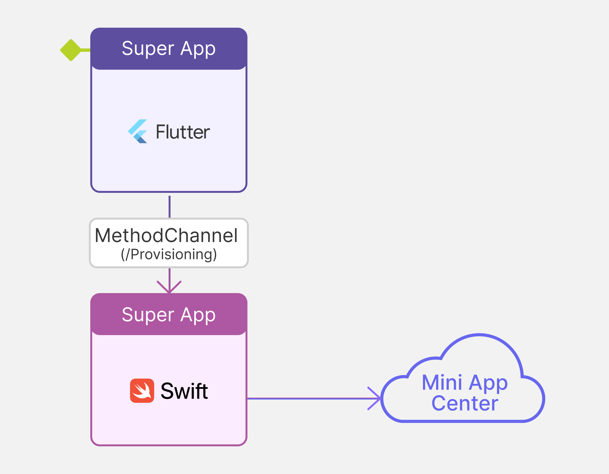
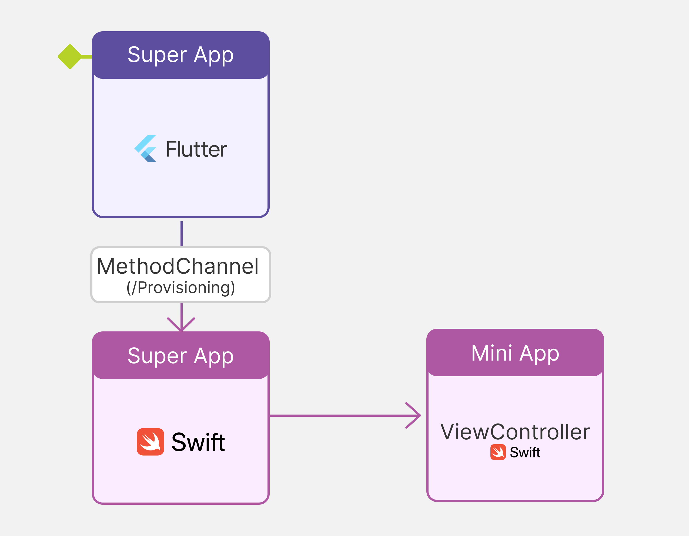

# Flutter iOS Super App Example 

This document explains how to develop and integrate the functionality that provides the API for accessing the Mini App Center, as well as the API for managing their cache, based on the `ExampleSuperApp.xcodeproj` example. 

## Setting

There are certain initial configuration steps in the project Xcode:

1. Integration of the [iOS frameworks](../../../iOS/GeneXus%20Frameworks/README.md) corresponding to [Super App Render](../../../docs/SuperAppRender.md).
2. Set certain values in the app's [Info.plist](../example/ios/Runner/Info.plist):
	- `GXSuperAppProvisioningURL`: String corresponding to the [Mini App Center's](../../../docs/Provisioning.md) URL, the provisioning server of the Mini Apps.
	- `GXSuperAppId`: String corresponding to the Super App identifier, to be used at the Mini App Center. If this key is not included, the app's [bundle identifier](https://developer.apple.com/documentation/bundleresources/information_property_list/cfbundleidentifier) will be used.
	- `GXSuperAppVersion`: String corresponding to the Super App version, to be used at the Mini App Center. If this key is not included, the app's [CFBundleVersion](https://developer.apple.com/documentation/bundleresources/information_property_list/cfbundleversion) will be used.
	- `GXMiniprogramsEnabled`: Boolean with its value in true. Required to enable the Super App / Mini App functionality in the  [Super App Render](../../../docs/SuperAppRender.md).
3. The file [superapp.crt](../example/ios/Runner/superapp.crt), corresponding to the public key that verifies the signature of the Mini Apps, once it's downloaded from the Mini App Center. It must be an app resource with that name. 
	

## Communication API with the Mini App Center

To access the Mini Apps that are available on the Mini App Center, the class `GXSuperAppProvisioning` is used. It's included in the `GXSuperApp` framework.

This class provides four methods to load Mini Apps, using different criteria. 
In all cases, there are parameters in common:

- `start: Int` 0-based index of the start of the page.
- `count: Int` the number of elements to load (0 corresponds to unlimited).
- `completion: MiniAppsInfoCompletion` callback invoked when the asynchronous operation ends either with the result or with an error. 

In all the cases the return value is an operation that can be cancelled if necessary. 

```swift
    public typealias MiniAppsInfoCompletion = ((Result<[GXObjectsModel.GXMiniAppInformation], GXSuperApp.GXSuperAppProvisioning.ProvisioningError>) -> Void)
```

```swift
    /// Performs a request to the Mini App Center for an available Mini App with the given identifier.
    /// - Parameter id: The Mini App identifier to look for.
    /// - Parameter completion: Completion handler for the result.
    /// - Returns a cancelable operation.
    @discardableResult
    open class func miniAppInfoById(_ id: String, completion: @escaping GXSuperApp.GXSuperAppProvisioning.OptionalMiniAppInfoCompletion) -> GXFoundation.GXCancelableOperation
```

```swift
    /// Performs a request to the Mini App Center for available Mini Apps.
    /// - Parameter text: The string with the search criteria.
    /// - Parameter start: 0-based index from which elements will be returned.
    /// - Parameter count: Maximum number of returned elements ( 0 means all ).
    /// - Parameter completion: Completion handler for the result.
    /// - Returns a cancelable operation.
    open class func miniAppsInfoByText(_ text: String, start: Int, count: Int, completion: @escaping GXSuperApp.GXSuperAppProvisioning.MiniAppsInfoCompletion) -> GXFoundation.GXCancelableOperation
```

```swift
    /// Performs a request to the Mini App Center for available Mini Apps that are available inside the given circular region.
    /// - Parameter center: The center point of the specified region.
    /// - Parameter radius: The radius in meters of the circular region.
    /// - Parameter start: 0-based index from which elements will be returned.
    /// - Parameter count: Maximum number of returned elements ( 0 means all ).
    /// - Parameter completion: Completion handler for the result.
    /// - Returns a cancelable operation.
    open class func miniAppsInfoByLocation(center: CLLocationCoordinate2D, radius: CLLocationDistance, start: Int, count: Int, completion: @escaping GXSuperApp.GXSuperAppProvisioning.MiniAppsInfoCompletion) -> GXFoundation.GXCancelableOperation
```

```swift
    /// Performs a request to the Mini App Center for available Mini Apps with the given tag.
    /// - Parameter tag: The tag to search for (exact match).
    /// - Parameter start: 0-based index from which elements will be returned.
    /// - Parameter count: Maximum number of returned elements ( 0 means all ).
    /// - Parameter completion: Completion handler for the result.
    /// - Returns a cancelable operation.
    open class func miniAppsInfoByTag(tag: String, start: Int, count: Int, completion: @escaping GXSuperApp.GXSuperAppProvisioning.MiniAppsInfoCompletion) -> GXFoundation.GXCancelableOperation
```

```swift
    /// Performs a request to the Mini App Center for available featured Mini Apps.
    /// - Parameter start: 0-based index from which elements will be returned.
    /// - Parameter count: Maximum number of returned elements ( 0 means all ).
    /// - Parameter completion: Completion handler for the result.
    /// - Returns a cancelable operation.
    open class func featuredMiniAppsInfo(start: Int, count: Int, completion: @escaping GXSuperApp.GXSuperAppProvisioning.MiniAppsInfoCompletion) -> GXFoundation.GXCancelableOperation
```

```swift
    /// Performs a request to the Mini App Center for available Mini Apps given the filters.
    /// - Parameter miniAppFilters: Filter collection to apply to the search. It can contain multiple criteria.
    ///   Example of usage:
    ///   ```
    ///   let miniAppFilters: [GXSuperAppProvisioning.MiniAppFilter] = [
    ///       .init(field: "Field Name", operator: .equals, values: ["Test Mini App Name"])
    ///   ]
    ///   ```
    ///   This creates a filter that searches for Mini Apps with "Field Name" equals to "Test Mini App Name".
    /// - Parameter start: 0-based index from which elements will be returned.
    /// - Parameter count: Maximum number of returned elements ( 0 means all ).
    /// - Parameter completion: Completion handler for the result.
    /// - Returns a cancelable operation.
    open class func miniAppsInfoByFilters(miniAppFilters: [MiniAppFilter], start: Int, count: Int, completion: @escaping GXSuperApp.GXSuperAppProvisioning.MiniAppsInfoCompletion) -> GXFoundation.GXCancelableOperation
```
> **_NOTE:_**
> For general information on how GetByFilters works, please refer to:
> 
> - [General information](https://wiki.genexus.com/commwiki/wiki?57960,Provisioning.GetByFilters+method)
> - [How to configure attributes in Super Apps](https://wiki.genexus.com/commwiki/wiki?53316,HowTo%3A+Create+a+Super+App+on+the+Mini+App+Center#Attribute+Configuration+in+Super+Apps)
> - [How to instantiate attribute values at the Mini App Version level](https://wiki.genexus.com/commwiki/wiki?53318,HowTo%3A+Upload+a+Mini+App+version+to+the+Mini+App+Center#Instantiate+attribute+values+at+the+Mini+App+Version+level)

Practical usage examples are available in the source [ProvisioningAPI.swift](../example/ios/Runner/ProvisioningAPI.swift).

The example provided is developed in the native iOS language (swift), therefore [platform channels](https://docs.flutter.dev/platform-integration/platform-channels) must be used to invoke these methods. 

A diagram of this implementation is shown below.



### Error handling

In all cases, the error can be one of three types:

```swift
    public enum ProvisioningError : Error {

        /// Request to the Mini App Center was invalid with a description.
        case invalidRequest(String)

        /// Request failed due to a network error with an inner error.
        case networkError(Error)

        /// Mini App Center response was invalid with a description.
        case invalidResponse(String)
    }
```
    
- `invalidRequest` is an error in the caller. It includes a message to the developer with its cause. 
- `networkError` is a network error in communication with the Mini App Center, including an internal error. This case should be handled accordingly, as it is likely to occur in the final app, depending on the network conditions of the device. 
- `invalidResponse` is an invalid response from the Mini App Center. It includes a message to the developer with its cause. 

## Loads a Mini App

Once the Mini Apps information has been obtained from the Mini App Center, the class `GXMiniAppsManager`, which is included in the `GXSuperApp`, is used to load them.
The `loadMiniApp(info:completion)` method receives the Mini App's information obtained from the Mini App Center as its first parameter, and a callback at the end the operation as its second parameter, which can include an error if the loading failed for some reason (for example if the signature is not valid). 

```swift
    /// Loads a Mini App and transitions to it.
    /// - Parameter info: Mini App information to be loaded
    /// - Parameter completion: Completion handler.
    /// - Note: Mini App information is provided to the Super App by the Mini App Center. See *GXSuperAppProvisioning*.
    open class func loadMiniApp(info: GXObjectsModel.GXMiniAppInformation, completion: ((Error?) -> Void)? = nil)
```

A practical usage example is available in [ProvisioningAPI.swift](../example/ios/Runner/ProvisioningAPI.swift).
    
Once a Mini App is loaded, the `rootController` of the `keyWindow` is replaced by the Mini App's UI.
To return to the Super App, both the Mini App developer and the Super App developer can use the `exitFromMiniProgram()` method of the `GXMiniProgramLoader` class, also included in the `GXSuperApp` framework. This restores the existing `rootController` at the time the Mini App was loaded. 

The example provided is developed in the native iOS language (swift), therefore [platform channels](https://docs.flutter.dev/platform-integration/platform-channels) must be used to invoke these methods. 

A diagram of this implementation is shown below.



## Mini Apps Cache Management

After loading a Mini App for the first time, it will be kept in the Super App cache. In this way, the next time the Mini App is invoked, the loading will be almost instantaneous.

This will be the case until the cache is no longer valid and it will be discarded, which can occur in these situations:

#### Automatic by version update

When there is a new version of the Mini App published in the Mini App Center, the Mini App's package is downloaded again at the time of the Load.

#### Automatic according to properties declared by the Super App

In the Super App configuration file ([Info.plist](../example/ios/Runner/Info.plist)) these two properties can be set:

   - `GXMiniAppCacheMaxCount`: Value (numeric) to specify the number of Mini Apps that will be kept in the Super App cache. Zero means there is no limit. Otherwise, if the indicated number of Mini Apps in the cache is reached, then the oldest one is deleted before adding a new one.
   - `GXMiniAppCacheMaxDays`: Value (numeric) to specify the number of days each Mini App cache will be kept. Zero means that there is no time limit, otherwise, the time must be counted from the last use of the Mini App, not from the date it was downloaded.

#### Programmatically using the Mini App Cache API

To manually manage the Mini Apps cache, functionality is provided in the `GXMiniAppsManager` class, which is included in the `GXSuperApp` framework. 
A method to get a list of the Mini Apps in the cache is included (`cachedMiniApps`), one to delete a specific Mini App from the cache (`removeCachedMiniApp`), and another one to delete all the Mini Apps from the cache (`clearCachedMiniApps`).

```swift
    /// Queries the file system for cached Mini Apps.
    /// - Returns: Collection of cached Mini Apps.
    /// - Note: Performs several file IO operations depending on the number of cached Mini Apps. To avoid blocking the main thread, consider calling on a background queue.
    open class func cachedMiniApps() throws -> [GXSuperApp.GXCachedMiniApp]

    /// Removes the Mini App from cache if found for the given identifier and version.
    /// - Parameter miniAppId: The Mini App identifier.
    /// - Parameter miniAppVersion: The Mini App version to remove. If not specified, any version is removed, otherwise remove is performed only if version matches or cached version is unknown.
    /// - Returns: True if the Mini App was found, false otherwise.
    /// - Note: Performs several file IO operations. To avoid blocking the main thread, consider calling on a background queue.
    open class func removeCachedMiniApp(id miniAppId: String, version miniAppVersion: Int? = nil) throws -> Bool

    /// Removes all Mini Apps from cache.
    /// - Note: Performs several file IO operations depending on the number of cached Mini Apps. To avoid blocking the main thread, consider calling on a background queue.
    open class func clearCachedMiniApps() throws
```

In any other case, the Mini App is kept in the cache indefinitely and the OS itself could remove it from the cache at its discretion since it is stored in a temporary directory.
