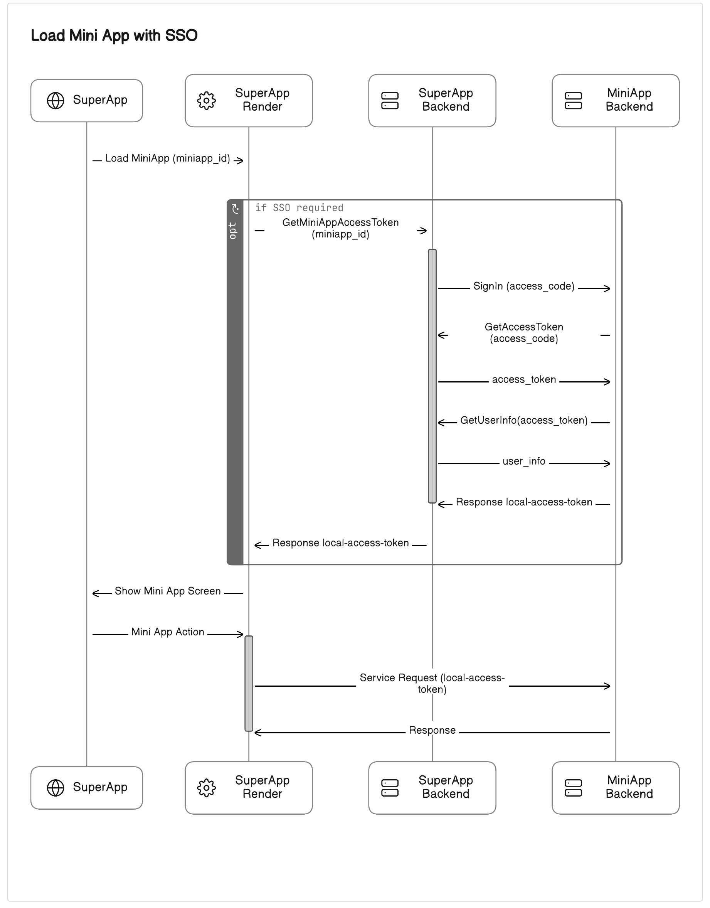

# Single Sign-On (SSO) in GeneXus Super Apps Technologies

Single Sign-On (SSO) is an authentication mechanism designed to streamline user access to multiple Mini Apps within a Super App. This approach allows users to authenticate once at Super App and gain access to various Mini Apps without the need to log in separately to each one.

## How it works?

In the context where both the Super App and the Mini App support Single Sign-On (SSO), the process of loading a Mini App involves the following steps:

1. **Invocation of the Identity Provider (IdP) by the Super App**: When loading a Mini App, the Super App invokes a URL on its backend, which serves as the Identity Provider (IdP), to obtain the authentication token required for SSO.

2. **Token generation within the Mini App**: Once the Super App retrieves the token from the IdP, it is generated within the Mini App. This token is unique to the user and the specific Mini App being accessed.

3. **Token transmission in different Scenarios**:
   
   - **For Native GX Mini Apps with GAM Integration**: If the Mini App is a Native GeneXus App integrated with [Genexus Access Manager (GAM)](https://wiki.genexus.com/commwiki/wiki?24746,Table+of+contents%3AGeneXus+Access+Manager+%28GAM%29), the Super App Render itself sends this token when invoking backend services of the Mini App that require authentication.
   
   - **For Web or Custom Authentication Mini Apps**: If the Mini App is a Web application or uses another authentication mechanism (not GAM), the Super App provides the token to the Mini App by passing the token in the header during the invocation of the EntryPointURL for Web Mini Apps, or during the call to services for native Mini Apps. In this way, the Mini App developer is responsible for including this token in the invocation of secure services.

4. **Token verification by the Mini App Backend**: Upon receiving the token, the backend of the Mini App verifies it against the IdP of the Super App to ensure the authenticity and authorization of the user.

This process ensures seamless authentication and access to Mini Apps within the Super App ecosystem, enhancing user experience and security across the platform.

The following diagram shows the overall interaction:

## Single Sign-On (SSO) setup in Mini App Center

To enable Single Sign-On (SSO) functionality in the [Mini App Center](https://wiki.genexus.com/commwiki/wiki?51290,Table+of+contents%3AMini+App+Center), ensure the following configurations are set:

1. Super App is marked with `Security = True`. This setting indicates that the Super App supports security features, including SSO integration.

2. Mini App Version is marked with `Integrated Security = True`. This setting signifies that the Mini App Version supports integrated security features, including SSO functionality.

## How to implement SSO using GeneXus Access Manager (GAM)?

To implement Single Sign-On (SSO) using [Genexus Access Manager (GAM)](https://wiki.genexus.com/commwiki/wiki?24746,Table+of+contents%3AGeneXus+Access+Manager+%28GAM%29), you can refer to the following link for detailed instructions and guidelines:

[Single Sign-On (SSO) Implementation Guide with Genexus Access Manager (GAM)](https://wiki.genexus.com/commwiki/wiki?56035,HowTo%20-%20Use%20OAuth%202.0%20endpoints%20to%20authenticate%20a%20Mini%20App%20from%20a%20Super%20App)

## How to implement SSO in Super App Render?

To implement Single Sign-On (SSO) functionality in Super App Render for both iOS and Android platforms, follow these examples:

- [Android](/Android/SingleSignOn.md)
- [iOS](/iOS/SingleSignOn.md)

